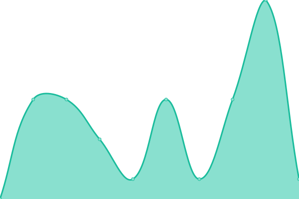

# [📈 Live Status](https://VoisinsVigilants.github.io/upptime): <!--live status--> **🟥 Complete outage**

This repository contains the open-source uptime monitor and status page for [VoisinsVigilants](https://VoisinsVigilants.github.io/upptime), powered by [Upptime](https://github.com/upptime/upptime).

With [Upptime](https://upptime.js.org), you can get your own unlimited and free uptime monitor and status page, powered entirely by a GitHub repository. We use [Issues](https://github.com/VoisinsVigilants/upptime/issues) as incident reports, [Actions](https://github.com/VoisinsVigilants/upptime/actions) as uptime monitors, and [Pages](https://VoisinsVigilants.github.io/upptime) for the status page.

<!--start: status pages-->
<!-- This summary is generated by Upptime (https://github.com/upptime/upptime) -->
<!-- Do not edit this manually, your changes will be overwritten -->
<!-- prettier-ignore -->
| URL | Status | History | Response Time | Uptime |
| --- | ------ | ------- | ------------- | ------ |
|  [Site Voisins Vigilants et Solidaires (PROD)](https://__app.voisinsvigilants.org) | 🟥 Down | [site-voisins-vigilants-et-solidaires-prod.yml](https://github.com/VoisinsVigilants/upptime_staging/commits/HEAD/history/site-voisins-vigilants-et-solidaires-prod.yml) | 

 314ms
     
 | 

<a href="https://VoisinsVigilants.github.io/upptime_staging/history/site-voisins-vigilants-et-solidaires-prod">50.25%</a>
    

|  [B2B - Voisins Vigilants Connect (Staging)](https://__staging.voisinsvigilants-connect.org) | 🟥 Down | [b2-b-voisins-vigilants-connect-staging.yml](https://github.com/VoisinsVigilants/upptime_staging/commits/HEAD/history/b2-b-voisins-vigilants-connect-staging.yml) | 

 983ms
     
 | 

<a href="https://VoisinsVigilants.github.io/upptime_staging/history/b2-b-voisins-vigilants-connect-staging">50.25%</a>
    

|  [Hodatis (Staging)](https://__staging.hodatis.com) | 🟥 Down | [hodatis-staging.yml](https://github.com/VoisinsVigilants/upptime_staging/commits/HEAD/history/hodatis-staging.yml) | 

 954ms
     
 | 

<a href="https://VoisinsVigilants.github.io/upptime_staging/history/hodatis-staging">50.62%</a>
    

|  [Api B2C - Api Voisins Vigilants (Staging)](__staging-api-flutter.voisinsvigilants.org) | 🟥 Down | [api-b2-c-api-voisins-vigilants-staging.yml](https://github.com/VoisinsVigilants/upptime_staging/commits/HEAD/history/api-b2-c-api-voisins-vigilants-staging.yml) | 

 5ms
     
 | 

<a href="https://VoisinsVigilants.github.io/upptime_staging/history/api-b2-c-api-voisins-vigilants-staging">0.00%</a>
    

|  [Data - Voisins Vigilants Data (Staging)](https://__staging.voisinsvigilants-data.org/) | 🟥 Down | [data-voisins-vigilants-data-staging.yml](https://github.com/VoisinsVigilants/upptime_staging/commits/HEAD/history/data-voisins-vigilants-data-staging.yml) | 

 1036ms
     
 | 

<a href="https://VoisinsVigilants.github.io/upptime_staging/history/data-voisins-vigilants-data-staging">0.00%</a>
    

|  [Territoire - Territoire Vigilant (Staging)](https://__staging.territoirevigilant.org) | 🟥 Down | [territoire-territoire-vigilant-staging.yml](https://github.com/VoisinsVigilants/upptime_staging/commits/HEAD/history/territoire-territoire-vigilant-staging.yml) | 

 965ms
     
 | 

<a href="https://VoisinsVigilants.github.io/upptime_staging/history/territoire-territoire-vigilant-staging">50.25%</a>
    

<!--end: status pages-->

[**Visit our status website →**](https://VoisinsVigilants.github.io/upptime)

## 📄 License

- Powered by: [Upptime](https://github.com/upptime/upptime)
- Code: [MIT](./LICENSE) © [Anand Chowdhary](https://anandchowdhary.com), supported by [Pabio](https://pabio.com)
- Data in the `./history` directory: [Open Database License](https://opendatacommons.org/licenses/odbl/1-0/)
